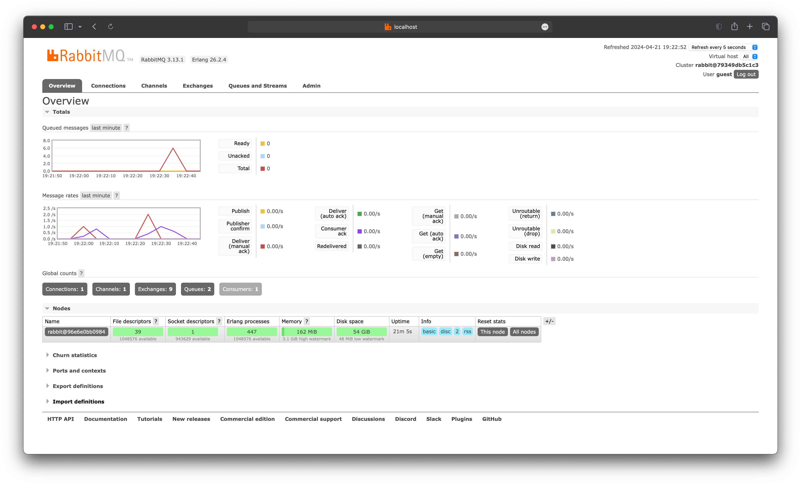
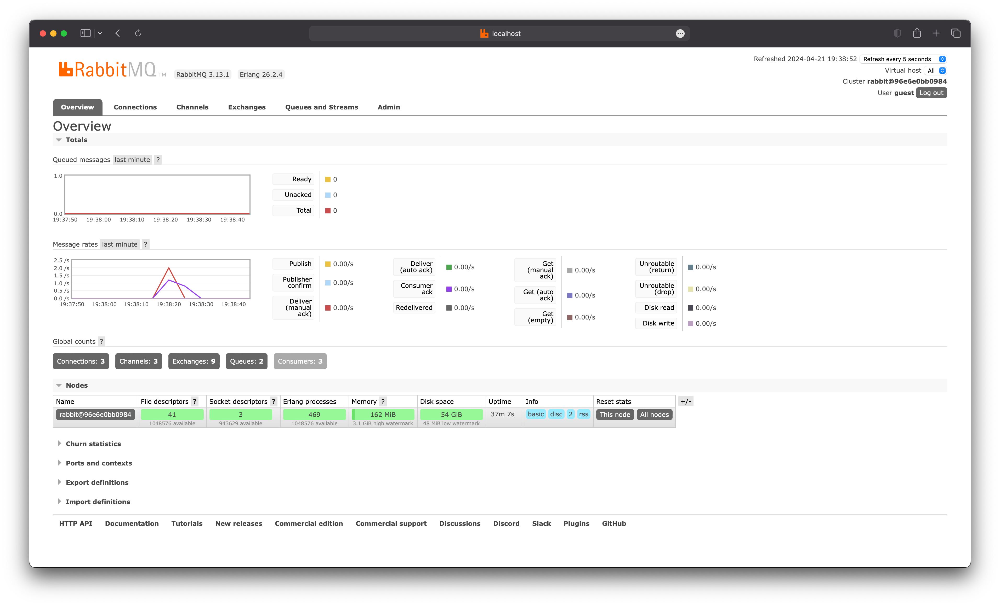

# Tutorial 8 - Advanced Programming - Subscriber
**Akmal Ramadhan - 2206081534 - Kelas A**

## Apa itu `amqp`?
`amqp` atau Advanced Message Queuing Protocol (AMPQ) adalah protokol komunikasi jaringan yang berfungsi untuk mengirimkan pesan antara aplikasi, organisasi, atau komponen yang berbeda. AMQP dapat mendukung _programming load balancing_ dan _monitoring_ karena adanya pemisahan pertukaran (yang _producer_ kirim) dan antrean (yang _customer_ dengar). 

Pada `main.rs`, AMQP diimplementasikan untuk _message queuing_ yang menghubungkan `UserCreatedHandler` dengan `main` menggunakan `CrosstownBus`. `UserCreatedHandler` dapat menerima pesan yang dikirimkan ke _queue_ dengan topik `"user_created"`.

## Apa arti dari `guest:guest@localhost:5672` ?
`guest:guest@localhost:5672` adalah URL yang mengoneksikan ke _server_ AMQP.

- `guest` pertama merujuk pada _username_ untuk autentikasi RabbitMQ.
- `guest` kedua merujuk pada _password_ untuk autentikasi RabbitMQ.
- `localhost` artinya bahwa _server_ AMQP berjalan di mesin yang sama dengan jalannya program.
- `5672` adalah _default port server_ AMQP dan akan digunakan oleh _server_ RabbitMQ untuk menerima koneksi dari _client_.

## Message Broker dengan RabbitMQ
### Simulation slow subscriber.

Pada gambar di atas, saya membuat _subscriber_ lamban dalam menerima atau mengelola data dari _message broker_ dengan _delay_ 1 detik untuk tiap prosesnya. Yang terjadi adalah _queued messages_ pada _message broker_ akan bertambah seiring dengan bertambahnya _delay_ yang diberikan karena publisher lebih cepat mengirim dibandingkan subscriber yang menerima. Pada kasus saya, banyaknya _queued messages_ pada _message broker_ adalah 6 untuk dua kali melakukan _run_ Publisher.

### One publisher and three subscribers.

Hal yang sama saya lakukan seperti pada bagian **Simulation slow subscriber**. Jika kita menjalankan lebih satu _subcribers_, pengiriman data jauh lebih cepat dan pada kasus saya terlihat bahwa tidak ada yang masuk ke dalam _queued messages_ pada _message broker_. Hal ini terjadi karena _message broker_ akan mendistribusikan data yang diterima dari Publisher ke banyak _subscribers_ yang terhubung.

Tanpa mengubah kode dari program, kita bisa memperoleh hasil yang berbeda dengan mengubah konfigurasi _message broker_ atau jumlah dari _subscriber_ yang berjalan. Inilah yang disebut dengan _event driven_.

## Referensi
- Module 8 - Software Architecture oleh Ade Azurat dan Tim Pengajar.
- [About - AMQP](https://www.amqp.org/about/what)